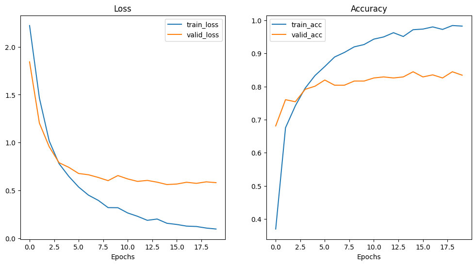
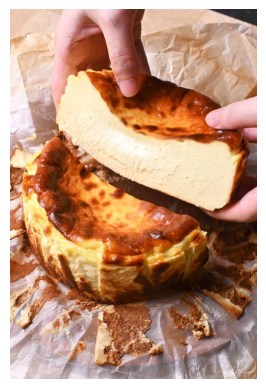

# Introduction

This project focuses on fine-tuning a ResNet-50 model for food image classification to gain hands-on experience in transfer learning and fine-tuning techniques. Using the Food-Category-Classification-v2.0 dataset from Hugging Face, the goal is to adapt the pre-trained model to accurately classify images into diverse food categories. This project enhances practical skills in vision model adaptation and deep learning for real-world applications.

🔍 Check the model from Hugging Face here: [ResNet-50](https://huggingface.co/microsoft/resnet-50)

🔍 Check the dataset from Hugging Face here: [Dataset](https://huggingface.co/datasets/Kaludi/food-category-classification-v2.0#dataset-fields)


# Data Creation

The initial step involves organizing and preparing the data for preprocessing and training. The objective is to retrieve the dataset, arrange it into directories, and compress it into a zip file. This ensures the data is well-structured and ready for future use.

🔍 Check the full notebook of data creation: [Notebook](https://github.com/tnbsuntae/Food_Image_Classification_Project/blob/main/data_creation.ipynb)

## 1. Load dataset from Hugging Face
The dataset is directly downloaded from the Hugging Face platform and split into training and validation sets for use.

```Python
from datasets import load_dataset

# Load dataset from huggingface
train_dataset = load_dataset("Kaludi/food-category-classification-v2.0", split="train")
valid_dataset = load_dataset("Kaludi/food-category-classification-v2.0", split="validation")
```

## 2. Create data directories
The `train_dir` and `valid_dir` folders have been set up within `base_dir` to store the training and validation data separately.

```Python
import os
import pathlib

# Define base directory
base_dir = pathlib.Path("data/")
train_dir = base_dir / 'train'
valid_dir = base_dir / 'valid'

# Create subdirectories for train and validation datasets
os.makedirs(train_dir, exist_ok=True)
os.makedirs(valid_dir, exist_ok=True)
```

## 3. Save images into folders
A function has been developed to organize images into class-specific subfolders. The purpose of this function is to create a subfolder for each class and store the corresponding images in their respective folders.

```Python
def save_images_to_subdirectories(dataset, base_path):
    """
    Save images into subdirectories based on labels.

    Args:
        dataset: Hugging Face Dataset object.
        base_path: Path to save the dataset.
    """
    # Create a mapping from label IDs to class names
    label_mapping = dataset.features['label'].int2str

    for i, item in enumerate(dataset):
        image = item['image']  # PIL Image
        label = item['label']  # Label ID
        class_name = label_mapping(label)  # Convert label ID to class name

        # Create the class-specific directory if not exists
        class_dir = os.path.join(base_path, class_name)
        os.makedirs(class_dir, exist_ok=True)

        # Convert image to 'RGB' if necessary
        if image.mode != 'RGB':
            image = image.convert('RGB')

        # Save the image in the format 'image_index.jpg'
        image_path = os.path.join(class_dir, f'image_{i}.jpg')
        image.save(image_path)
```

Both the training and validation sets need to go through this function to ensure their images are properly organized.

```Python
print("Saving images...")

# Save train images
save_images_to_subdirectories(train_dataset, train_dir)

# Save validation images
save_images_to_subdirectories(valid_dataset, valid_dir)

print("Images saved successfully!")
```

Another function has been developed to iterate through and count the number of images in each folder.

```Python
# Check lengths of directories
def walk_through_dir(dir_path):
  """
  Walks through dir_path returning its contents.
  Args:
    dir_path (str): target directory

  Returns:
    A print out of:
      number of subdiretories in dir_path
      number of images (files) in each subdirectory
      name of each subdirectory
  """
  import os
  for dirpath, dirnames, filenames in os.walk(dir_path):
    print(f"There are {len(dirnames)} directories and {len(filenames)} images in '{dirpath}'.")

walk_through_dir(base_dir)
```
```
>>>Output:
There are 2 directories and 0 images in 'data'.
There are 12 directories and 0 images in 'data/train'.
There are 0 directories and 100 images in 'data/train/Dessert'.
There are 0 directories and 98 images in 'data/train/Seafood'.
There are 0 directories and 100 images in 'data/train/Egg'.
There are 0 directories and 100 images in 'data/train/Noodles'.
There are 0 directories and 100 images in 'data/train/Bread'.
There are 0 directories and 100 images in 'data/train/Dairy'.
There are 0 directories and 100 images in 'data/train/Fried Food'.
There are 0 directories and 100 images in 'data/train/Meat'.
There are 0 directories and 100 images in 'data/train/Rice'.
There are 0 directories and 100 images in 'data/train/Vegetable'.
There are 0 directories and 100 images in 'data/train/Soup'.
There are 0 directories and 100 images in 'data/train/Fruit'.
There are 12 directories and 0 images in 'data/valid'.
There are 0 directories and 25 images in 'data/valid/Dessert'.
There are 0 directories and 25 images in 'data/valid/Seafood'.
There are 0 directories and 25 images in 'data/valid/Egg'.
There are 0 directories and 25 images in 'data/valid/Noodles'.
There are 0 directories and 25 images in 'data/valid/Bread'.
There are 0 directories and 25 images in 'data/valid/Dairy'.
There are 0 directories and 25 images in 'data/valid/Fried Food'.
There are 0 directories and 25 images in 'data/valid/Meat'.
There are 0 directories and 25 images in 'data/valid/Rice'.
There are 0 directories and 25 images in 'data/valid/Vegetable'.
There are 0 directories and 25 images in 'data/valid/Soup'.
There are 0 directories and 25 images in 'data/valid/Fruit'.
```

## 4. Compress all folders and save
As this project is conducted on Google Colab, we need to grant access to Google Drive to save the zip file there.

```Python
from google.colab import drive
# Grant access to google drive
drive.mount('/content/drive')
```

All folders have been combined into a single zip file and stored at the `zip_file_path` location.

```Python
import shutil

# Path to the directory you want to zip
directory_to_zip = base_dir

# Path to save the zip file in Google Drive
zip_file_path = '/content/drive/My Drive/Colab Notebooks/personal_projects/food_image_classification/food_images.zip'

# Create a zip file
shutil.make_archive(zip_file_path.replace('.zip', ''), 'zip', directory_to_zip)

print(f"Directory zipped and saved to: {zip_file_path}")
```

# Model Fine Tuning

The next step is to fine-tune the ResNet-50 model using the previously created food image dataset. The model should be capable of accurately classifying the type of food in a random food image.

🔍 Check the full notebook of data creation: [Notebook](https://github.com/tnbsuntae/Food_Image_Classification_Project/blob/main/resnet50_model_finetuning.ipynb)

## 1. Get access to the data
The first step is to download the zip file and extract its contents into folders.

```Python
import requests
import zipfile
from pathlib import Path

# Setup a directory to store images
data_path = Path("data/")
zip_path = Path("food_images.zip")

# If the directory doesn't exist, download it and prepare it
if data_path.is_dir():
  print(f"{data_path} directory already exists... skipping download")
else:
  print(f"{data_path} does not exist, creating one...")
  data_path.mkdir(parents=True, exist_ok=True)

# Download the zip file
with open(zip_path, "wb") as f:
  print("Downloading food data...")
  request = requests.get("https://github.com/tnbsuntae/food_classification/raw/refs/heads/main/food_images.zip")
  f.write(request.content)

# Unzip the file
with zipfile.ZipFile(zip_path, "r") as zip_ref:
  print("Unzipping food data...")
  zip_ref.extractall(data_path)

print("Download and extraction complete")
```

## 2. Download ResNet-50 model from Hugging Face
ResNet-50 model and its image processor have been downloaded

```Python
# Load model
from transformers import AutoImageProcessor, AutoModelForImageClassification

processor = AutoImageProcessor.from_pretrained("microsoft/resnet-50")
model = AutoModelForImageClassification.from_pretrained("microsoft/resnet-50")
```

## 3. Create dataset class for preprocessing image data

### 3.1 Create `find_classes()` function
A function is created as part of the dataset class, which returns a list of class names and a dictionary mapping class names to their corresponding indexes.

```Python
import os

def find_classes(directory: str):
  """Finds the class folder names in a target directory."""
  # 1. Get the class names by scanning the target directory
  classes = sorted(entry.name for entry in os.scandir(directory) if entry.is_dir())

  # 2. Raise an error if class names could not be found
  if not classes:
    raise FileNotFoundError(f"Couldn't find any classes in {directory}... please check file structure.")

  # 3. Create a dictionary of index labels (computers prefer numbers rather than strings as labels)
  class_to_idx = {class_name: i for i, class_name in enumerate(classes)}
  return classes, class_to_idx

class_names, class_to_idx = find_classes(train_dir)
class_names, class_to_idx
```
```
>>>Output:
(['Bread',
  'Dairy',
  'Dessert',
  'Egg',
  'Fried Food',
  'Fruit',
  'Meat',
  'Noodles',
  'Rice',
  'Seafood',
  'Soup',
  'Vegetable'],
 {'Bread': 0,
  'Dairy': 1,
  'Dessert': 2,
  'Egg': 3,
  'Fried Food': 4,
  'Fruit': 5,
  'Meat': 6,
  'Noodles': 7,
  'Rice': 8,
  'Seafood': 9,
  'Soup': 10,
  'Vegetable': 11})
```
### 3.2 Create `ImageDataset()` class

```Python
from torch.utils.data import Dataset
import numpy as np

class ImageDataset(Dataset):
  def __init__(self, targ_dir, processor):
    self.paths = list(Path(targ_dir).glob("*/*.jpg"))
    self.processor = processor
    self.classes, self.class_to_idx = find_classes(targ_dir)

  def load_image(self, index):
    """Load an image given its index"""
    image_path = self.paths[index]
    return Image.open(image_path)

  def __len__(self):
    return len(self.paths)

  def __getitem__(self, index):
    """
    Return a dictionary containing:
    - processed_image: Tensor for the image.
    - label: Class index for the image.
    """
    img = self.load_image(index)
    class_names = self.paths[index].parent.name # Path format: data_folder/class_name/image.jpg
    class_idx = self.class_to_idx[class_names]

    # Apply preprocessing
    processed_img = self.processor(img, return_tensors='pt')['pixel_values'].squeeze(0)

    return {"image": processed_img, "label": torch.tensor(class_idx, dtype=torch.long)}

train_data = ImageDataset(targ_dir=train_dir,
                                      processor=processor)
valid_data = ImageDataset(targ_dir=valid_dir,
                                      processor=processor)
```

## 4. Batch the data
The `DataLoader` has been used to batch all data into 32 different batches

```Python
# Turn datasets into DataLoader
from torch.utils.data import DataLoader
import os

BATCH_SIZE = 32
NUM_WORKERS = os.cpu_count()

train_dataloader = DataLoader(dataset=train_data,
                              batch_size=BATCH_SIZE,
                              num_workers=NUM_WORKERS,
                              shuffle=True)
valid_dataloader = DataLoader(dataset=valid_data,
                              batch_size=BATCH_SIZE,
                              num_workers=NUM_WORKERS,
                              shuffle=False)

train_dataloader, valid_dataloader
```

## 5. Fine tune ResNet-50 model

The base layers of all models have been frozen, leaving only the classifier head available for modification and training.

```Python
# Freeze base layers
for name, param in model.base_model.named_parameters():
    param.requires_grad = False

# Update the classifier head
from torch import nn

model.classifier = nn.Sequential(
    nn.Flatten(),
    nn.Linear(in_features=2048, out_features=1024),
    nn.ReLU(),
    nn.Dropout(p=0.4),
    nn.Linear(in_features=1024,
              out_features=len(class_names))) # how many classes do we have?

model.classifier
```
```
>>>Output:
Sequential(
  (0): Flatten(start_dim=1, end_dim=-1)
  (1): Linear(in_features=2048, out_features=1024, bias=True)
  (2): ReLU()
  (3): Dropout(p=0.4, inplace=False)
  (4): Linear(in_features=1024, out_features=12, bias=True)
)
```

## 6. Train ResNet-50 model

Training the model requires the development of one class and three distinct functions:

* `EarlyStopping()`: a class to implement the EarlyStopping mechanism.
* `train_step()`: a function to define the training loop.
* `valid_step()`: a function to define the validation loop.
* `train()`: a function that integrates the class and the other functions, coordinating their execution.

### 6.1 Create `train_step()` function

```Python
# Create train step function
def train_step(model: torch.nn.Module,
               dataloader: torch.utils.data.DataLoader,
               loss_fn: torch.nn.Module,
               optimizer: torch.optim.Optimizer,
               device=device):
  model.train()

  train_loss, train_acc = 0, 0

  for batch in dataloader:
    # Extract data and send to target device
    X, y = batch['image'].to(device), batch['label'].to(device)

    # Forward pass
    y_pred = model(X)['logits']

    # Calculate loss
    loss = loss_fn(y_pred, y)
    train_loss += loss.item()

    # Optimizer zero grad
    optimizer.zero_grad()

    # Loss backward
    loss.backward()

    # Optimizer step
    optimizer.step()

    # Calculate accuracy
    y_pred_class = torch.argmax(torch.softmax(y_pred, dim=1), dim=1)
    train_acc += (y_pred_class==y).sum().item()/len(y_pred)

  # Calculate average loss and accuracy per batch
  train_loss = train_loss / len(dataloader)
  train_acc = train_acc / len(dataloader)

  return train_loss, train_acc
```

### 6.2 Create `valid_step()` function

```Python
# Create valid_step function
def valid_step(model: torch.nn.Module,
              dataloader: torch.utils.data.DataLoader,
              loss_fn: torch.nn.Module,
              device=device):
  model.eval()

  valid_loss, valid_acc = 0, 0

  with torch.inference_mode():
    for batch in dataloader:
      # Extract data and send to target device
      X, y = batch['image'].to(device), batch['label'].to(device)

      # Forward pass
      y_pred = model(X)['logits']

      # Calculate loss
      loss = loss_fn(y_pred, y)
      valid_loss += loss.item()

      # Calculate accuracy
      y_pred_class = torch.argmax(torch.softmax(y_pred, dim=1), dim=1)
      valid_acc += (y_pred_class==y).sum().item()/len(y_pred)

  # Calculate average loss and accuracy per batch
  valid_loss = valid_loss / len(dataloader)
  valid_acc = valid_acc / len(dataloader)

  return valid_loss, valid_acc
```

### 6.3 Create `EarlyStopping()` class

```Python
class EarlyStopping:
  def __init__(self, patience=5, delta=0.01, save_path="best_model.pth"):
    """
    Args:
      patience (int): Number of epochs to wait for improvement.
      delta (float): Minimum change to qualify as improvement.
      save_path (str): Path to save the best model
    """
    self.patience = patience
    self.delta = delta
    self.save_path = save_path
    self.counter = 0
    self.best_loss = float('inf')
    self.early_stop = False

  def __call__(self, val_loss, model):
    if val_loss < self.best_loss - self.delta:
      self.best_loss = val_loss
      self.counter = 0
      torch.save(model.state_dict(), self.save_path) # Save the best model
    else:
      self.counter += 1
      if self.counter >= self.patience:
        self.early_stop = True
```

### 6.4 Create `train()` function

```Python
# Create train function
from tqdm.auto import tqdm

def train(model: torch.nn.Module,
          train_dataloader: torch.utils.data.DataLoader,
          valid_dataloader: torch.utils.data.DataLoader,
          optimizer: torch.optim.Optimizer,
          loss_fn: torch.nn.Module,
          epochs: int,
          patience: int = 5,
          delta: float = 0.01,
          save_path: str = "best_model.pth",
          device=device):

  # Initialize EarlyStopping
  early_stopping = EarlyStopping(patience=patience, delta=delta, save_path=save_path)

  results = {"train_loss": [],
             "train_acc": [],
             "valid_loss": [],
             "valid_acc": []}

  for epoch in tqdm(range(epochs)):
    train_loss, train_acc = train_step(model=model,
                                       dataloader=train_dataloader,
                                       loss_fn=loss_fn,
                                       optimizer=optimizer,
                                       device=device)

    valid_loss, valid_acc = valid_step(model=model,
                                       dataloader=valid_dataloader,
                                       loss_fn=loss_fn,
                                       device=device)

    # Print results in each epoch
    print(f"Epoch: {epoch} | Training Loss: {train_loss:.3f} | Training Accuracy: {train_acc:.3f} | Validation Loss: {valid_loss:.3f} | Validation Accuracy: {valid_acc:.3f}")

    # Store results
    results['train_loss'].append(train_loss)
    results['train_acc'].append(train_acc)
    results['valid_loss'].append(valid_loss)
    results['valid_acc'].append(valid_acc)

    # Check and save the best epoch
    if valid_loss == min(results['valid_loss']):
      best_epoch = epoch

    # Early stopping
    early_stopping(valid_loss, model)

    if early_stopping.early_stop:
      print(f"Early stopping triggered at epoch {epoch}. Best validation loss was at epoch {best_epoch}.")
      break

  # Load the best model
  model.load_state_dict(torch.load(save_path, weights_only=True))
  print(f"Best model loaded from {save_path}")

  return results
```

### 6.5 Train the model

```Python
# Set number of epochs
NUM_EPOCHS = 25

# Set EarlyStopping parameters
PATIENCE = 5
DELTA = 0.01
SAVE_PATH = "best_model.pth"

# Define loss and optimizer
loss_fn = nn.CrossEntropyLoss()
optimizer = torch.optim.AdamW([
    {'params': model.base_model.parameters(), 'lr': 1e-5, 'weight_decay': 1e-4},
    {'params': model.classifier.parameters(), 'lr': 5e-4, 'weight_decay': 1e-4}
])

# Send model to device
model = model.to(device)

# Start the timer
from timeit import default_timer as timer
start_time = timer()

# Train model
model_results = train(model=model,
                      train_dataloader=train_dataloader,
                      valid_dataloader=valid_dataloader,
                      optimizer=optimizer,
                      loss_fn=loss_fn,
                      epochs=NUM_EPOCHS,
                      patience=PATIENCE,
                      delta=DELTA,
                      save_path=SAVE_PATH,
                      device=device)

# End the timer
end_time = timer()

# Print out time duration
total_time = end_time - start_time
hours = int(total_time // 3600)
minutes = int((total_time % 3600) // 60)
print(f"Total training time: {hours} hr {minutes} min")
```
Training halted at epoch 19, saving the parameters from epoch 14, which achieved the lowest validation loss across all epochs.

**Score on epoch 14:**<br>
Training Loss: 0.156<br>
Training Accuracy: 0.972 <br>
Validation Loss: 0.561 <br>
Validation Accuracy: 0.845

```
>>>Output:
Epoch: 0 | Training Loss: 2.223 | Training Accuracy: 0.370 | Validation Loss: 1.843 | Validation Accuracy: 0.681
Epoch: 1 | Training Loss: 1.466 | Training Accuracy: 0.676 | Validation Loss: 1.203 | Validation Accuracy: 0.760
Epoch: 2 | Training Loss: 1.017 | Training Accuracy: 0.742 | Validation Loss: 0.956 | Validation Accuracy: 0.754
Epoch: 3 | Training Loss: 0.780 | Training Accuracy: 0.795 | Validation Loss: 0.789 | Validation Accuracy: 0.792
Epoch: 4 | Training Loss: 0.646 | Training Accuracy: 0.833 | Validation Loss: 0.741 | Validation Accuracy: 0.801
Epoch: 5 | Training Loss: 0.535 | Training Accuracy: 0.861 | Validation Loss: 0.676 | Validation Accuracy: 0.820
Epoch: 6 | Training Loss: 0.450 | Training Accuracy: 0.889 | Validation Loss: 0.663 | Validation Accuracy: 0.804
Epoch: 7 | Training Loss: 0.395 | Training Accuracy: 0.903 | Validation Loss: 0.635 | Validation Accuracy: 0.804
Epoch: 8 | Training Loss: 0.320 | Training Accuracy: 0.920 | Validation Loss: 0.601 | Validation Accuracy: 0.817
Epoch: 9 | Training Loss: 0.318 | Training Accuracy: 0.927 | Validation Loss: 0.654 | Validation Accuracy: 0.817
Epoch: 10 | Training Loss: 0.263 | Training Accuracy: 0.943 | Validation Loss: 0.619 | Validation Accuracy: 0.826
Epoch: 11 | Training Loss: 0.229 | Training Accuracy: 0.950 | Validation Loss: 0.594 | Validation Accuracy: 0.829
Epoch: 12 | Training Loss: 0.186 | Training Accuracy: 0.963 | Validation Loss: 0.604 | Validation Accuracy: 0.826
Epoch: 13 | Training Loss: 0.200 | Training Accuracy: 0.951 | Validation Loss: 0.585 | Validation Accuracy: 0.829
Epoch: 14 | Training Loss: 0.156 | Training Accuracy: 0.972 | Validation Loss: 0.561 | Validation Accuracy: 0.845
Epoch: 15 | Training Loss: 0.143 | Training Accuracy: 0.974 | Validation Loss: 0.566 | Validation Accuracy: 0.829
Epoch: 16 | Training Loss: 0.126 | Training Accuracy: 0.980 | Validation Loss: 0.584 | Validation Accuracy: 0.835
Epoch: 17 | Training Loss: 0.122 | Training Accuracy: 0.973 | Validation Loss: 0.573 | Validation Accuracy: 0.826
Epoch: 18 | Training Loss: 0.106 | Training Accuracy: 0.984 | Validation Loss: 0.589 | Validation Accuracy: 0.845
Epoch: 19 | Training Loss: 0.096 | Training Accuracy: 0.983 | Validation Loss: 0.580 | Validation Accuracy: 0.834

Early stopping triggered at epoch 19. Best validation loss was at epoch 14.
Best model loaded from best_model.pth
Total training time: 0 hr 17 min
```

### 6.6 Plot loss and accuracy curves of the training



## 7. Make a prediction on random food image

```Python
prediction_image = Image.open(custom_image_path)
inputs = processor(prediction_image, return_tensors="pt").to(device)

with torch.no_grad():
    outputs = model(**inputs)

custom_image_uint8 = torchvision.io.read_image(custom_image_path)

prediction_logits = outputs['logits']
prediction_probs = torch.softmax(prediction_logits, dim=1)
highest_prob = prediction_probs.squeeze(0).max().item()
prediction_label = torch.argmax(prediction_probs, dim=1)

print(f"Predicted Class: {(class_names[prediction_label])}")
print(f"Probability: {highest_prob*100:.2f}%")
plt.imshow(custom_image_uint8.permute(1, 2, 0))
plt.axis("off")
plt.show()
```

```
Predicted Class: Dessert
Probability: 44.05%
```


## 8. Save the model state dictionary
As this project is conducted on Google Colab, we need to grant access to Google Drive to save the zip file there.

```Python
from google.colab import drive
# Grant access to google drive
drive.mount('/content/drive')
```

The model's state dictionary has been saved at the `MODEL_SAVE_PATH` location.

```Python
# Create model directory path
MODEL_PATH = '/content/drive/My Drive/Colab Notebooks/personal_projects/food_image_classification'
os.makedirs(MODEL_PATH, exist_ok=True)

# Create model save
MODEL_NAME = "finetuned_resnet50.pth"
MODEL_SAVE_PATH = os.path.join(MODEL_PATH, MODEL_NAME)

# Save the model state dict
print(f"Saving model to: {MODEL_SAVE_PATH}")
torch.save(obj=model.state_dict(),
           f=MODEL_SAVE_PATH)
```

# Conclusion
This project successfully fine-tuned a ResNet-50 model for food image classification, demonstrating the practical application of transfer learning techniques. Using the Food-Category-Classification-v2.0 dataset, we structured and prepared the data, organized it into class-specific folders, and trained the model on well-defined datasets. By freezing the base layers and updating the classifier head, the model adapted to classify diverse food categories effectively.

This hands-on project not only enhanced our understanding of deep learning workflows but also provided valuable experience in utilizing pre-trained models for real-world tasks. The approach and techniques used here can be extended to similar classification challenges in other domains.